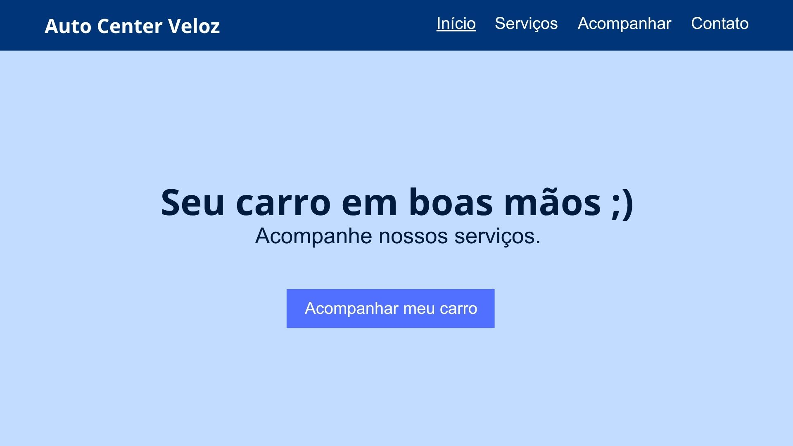
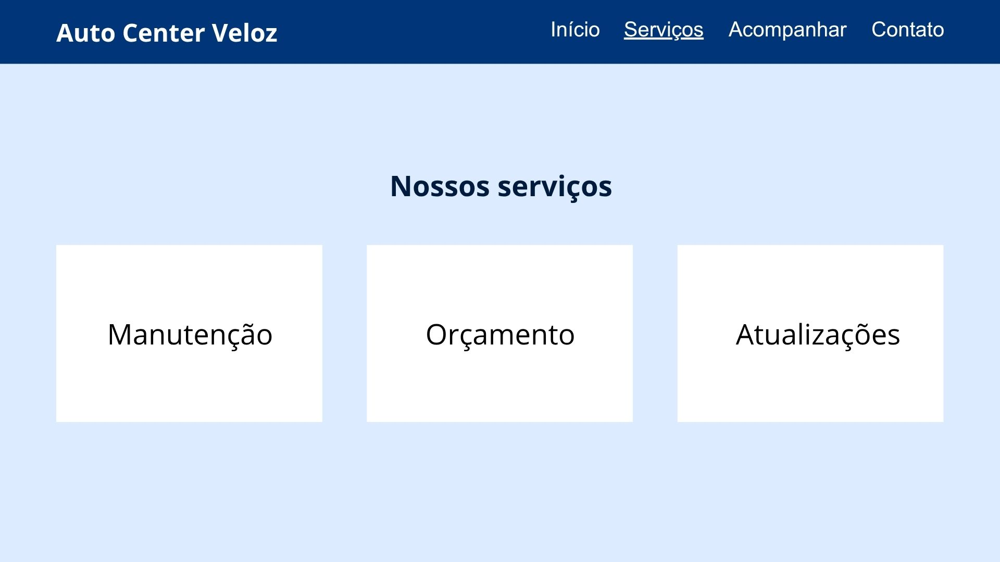
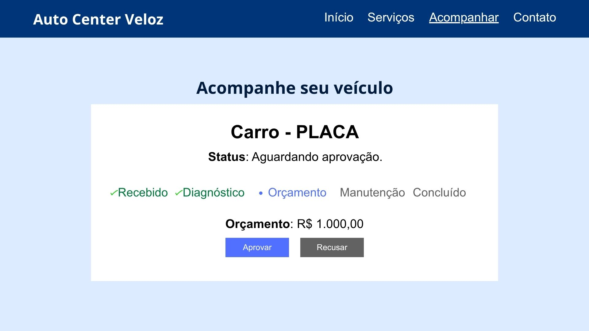
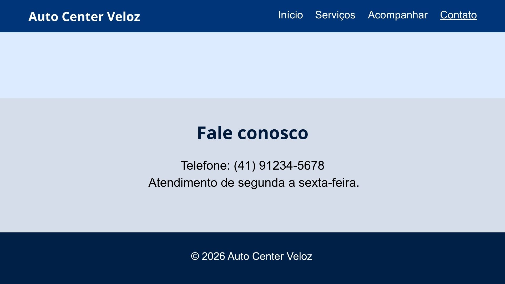

# Auto Center Veloz

Sistema web desenvolvido para melhorar a comunicação entre a oficina Auto Center Veloz e seus clientes.

## 📋 Briefing do Problema

A Auto Center Veloz é uma oficina mecânica especializada em manutenção preventiva e corretiva de veículos.

Atualmente, a comunicação com os clientes acontece principalmente por telefone e mensagens. Os clientes entram em contato para saber o andamento do serviço, consultar se o veículo já está pronto, solicitar informações sobre peças e aprovar orçamentos.

Esse processo gera alguns problemas:

* excesso de ligações para a recepção;
* demora na aprovação dos orçamentos;
* interrupções no trabalho dos mecânicos;
* veículos parados aguardando a aprovação do cliente;
* dificuldade para o cliente acompanhar o serviço.

Dessa forma, o projeto busca criar um canal digital mais rápido e transparente para melhorar a comunicação entre a oficina e seus clientes.

## 💡 Solução Escolhida

Foi desenvolvido um **Web App**, acessível pelo navegador, para centralizar as principais informações do atendimento.

A solução permite que o cliente:

* visualize informações sobre os serviços;
* acompanhe o status do veículo;
* consulte o orçamento;
* aprove ou recuse o orçamento;
* encontre informações de contato da oficina.

### Por que escolhemos um Web App?

A escolha de um Web App foi feita porque ele pode ser acessado diretamente pelo navegador, sem a necessidade de instalar um aplicativo no celular.

Além disso, a solução é simples de desenvolver, manter e utilizar, sendo adequada para o problema apresentado pela Auto Center Veloz.

## 🖥️ Protótipos e Telas

### Tela inicial
A tela inicial apresenta a oficina e direciona o cliente para as principais funcionalidades do sistema.

**Elementos principais:**
* apresentação da oficina;
* menu de navegação;
* serviços;
* acompanhamento do veículo;
* contato.



### Tela de serviços
Apresenta os principais serviços oferecidos pela oficina.



### Tela de acompanhamento
Permite visualizar o andamento do serviço do veículo.

Exemplo de informações apresentadas:
* veículo;
* placa;
* status do serviço;
* orçamento;
* opção para aprovar ou recusar o orçamento.



### Tela de contato
Apresenta as informações necessárias para o cliente entrar em contato com a oficina.



## 🏗️ Arquitetura do Projeto

O projeto utiliza uma estrutura simples baseada em tecnologias web:

```text
autocenter-veloz/
│
├── index.html
├── README.md
├── LICENSE
├── .gitignore
│
├── css/
│   └── style.css
│
└── js/
    └── script.js
```

### Tecnologias utilizadas

**HTML5**

Responsável pela estrutura e organização do conteúdo da página.

**CSS3**

Responsável pelo visual, layout, cores, espaçamentos e responsividade.

**JavaScript**

Responsável pelas interações da página, como as ações dos botões de aprovação e recusa do orçamento.

## ⚙️ Como Executar

### 1. Baixar ou clonar o projeto

Faça o download do projeto ou clone o repositório:

```bash
git clone https://github.com/viviferbufr/autocenter-veloz.git
```

### 2. Abrir o projeto

Entre na pasta do projeto:

```bash
cd autocenter-veloz
```

### 3. Executar

Como o projeto utiliza HTML, CSS e JavaScript, não é necessário instalar dependências.

Basta abrir o arquivo:

```text
index.html
```

em um navegador, como Google Chrome, Microsoft Edge ou Firefox.

## 🔐 Segurança

O projeto não utiliza senhas, tokens ou chaves de API.

Nenhuma credencial deve ser adicionada ao código ou ao histórico de commits.

## 📄 Licença

Este projeto está disponível sob a licença MIT.

## 👩‍💻 Projeto

**Auto Center Veloz**

Projeto desenvolvido para a disciplina de **Design Profissional**.
